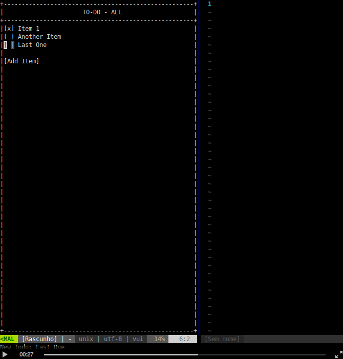

# VUI - Vim Ui Framework

Create applications that run inside Vim buffers

See it in action:

 

:warning: This plugin is in very early stage. Be aware that there are a few bugs yet to fix,
documentation are non-existent and API is unstable (can change).

## Installation

The installation is simple, use your preferred plugin manager:

    " vim-plug
    Plug 'waldson/vui'

    " Pathogen
    git clone https://github.com/waldson/vui.git

    " NeoBundle
    NeoBundle 'waldson/vui'

    " Vundle
    Plugin 'waldson/vui'

## Usage

**VUI** is composed of a bunch of
[autoload-functions](http://vimdoc.sourceforge.net/htmldoc/eval.html#autoload-functions)
that are used to create applications.

The first step is to create a **screen**. A screen is the responsible for
receiving input events, displaying components, and keeping track of the buffer:

    let my_app = vui#screen#new()

After that, you can begin laying out your application using **components**.
A component is an object (I mean a
[dictionary](http://vimdoc.sourceforge.net/htmldoc/eval.html#Dictionary)) that
render something on screens.

You create your applications by combining components. For example, to create a box with a text inside you could do something like this:

    let my_panel = vui#component#panel#new("Title", 10, 10)
    let my_text = vui#component#text#new('Text')

    call my_panel.add_child(my_text)

This will display something like this:

    +--------+
    |  Title |
    +--------+
    |Text    |
    |        |
    |        |
    |        |
    |        |
    |        |
    +--------+

Here are some core components that you can use:

- `vui#component#box#new(x, y, width, height)`

    Creates boxes like this:

        +------------------+
        |                  |
        |                  |
        |                  |
        |                  |
        +------------------+

- `vui#component#button#new(text)`

    Creates an interactive text component that can react to action events:

        let my_button = vui#component#button#new("Do something")

        function! my_button.on_action(button)
            " execute your action here
        endfunction

- `vui#component#input#new(width)`

    Creates a component that ask users for information:

        let my_input = vui#component#input#new(30)
        call my_input.set_placeholder("Enter your name: ")

- `vui#component#panel#new(title, width, height)`

    Creates a panel with a title and a content area:

        let my_panel = vui#component#panel#new('Title', 20, 10)
        " call my_panel.get_content_component().add_child(my_other_component)

    This component will be displayed like this:

        +------------------+
        |       Title      |
        +------------------+
        |                  |
        |                  |
        |                  |
        |                  |
        |                  |
        |                  |
        +------------------+

- `vui#component#toggle#new(text)`

    Creates a switch (on/off) component:

        let my_panel = vui#component#toggle#new('Activate something')

There are others components. Please check
[components'](https://github.com/waldson/vui/tree/master/autoload/vui/component)
folder for further information.

### Show the screen

After you set up your screen and component hierarchy, it's time to show it.
You have to set the root component that must be displayed when screen opens:

    call my_app.set_root_component(my_root_component)
    call my_app.show()

## Mappings

Here are the default mappings:

- `<Tab> | j` focus on next component
- `<S-Tab> | k` focus on previous component
- `J` focus on last component
- `K` focus on first component
- `<CR> | <Space>` perform action on focused component
- `r` refresh screen

Besides that, commands that enter insert and visual mode are disabled (`noremap <key> <nop>`).

You can add your custom mappings to your screen:

    " you can only map functions that belongs to your screen
    function! my_app.do_something()
        enew
    endfunction

    call my_app.map('a', 'do_something')

In this case, when you press `a`, a new buffer will be created.

## Example Application

Please check out the [to-do example](https://github.com/waldson/vui/blob/master/examples/todo.vim) on examples folder.

### To-do mappings

- `a` add a new item
- `o` add a new item
- `m` toggle visibility of items (all or only pending)
- `dd` delete an item
- `<CR>` toggle item

### How to run

- open `todo.vim` file (`e examples/todo.vim`)
- source the file (`source %`)
- press `<leader>td`

